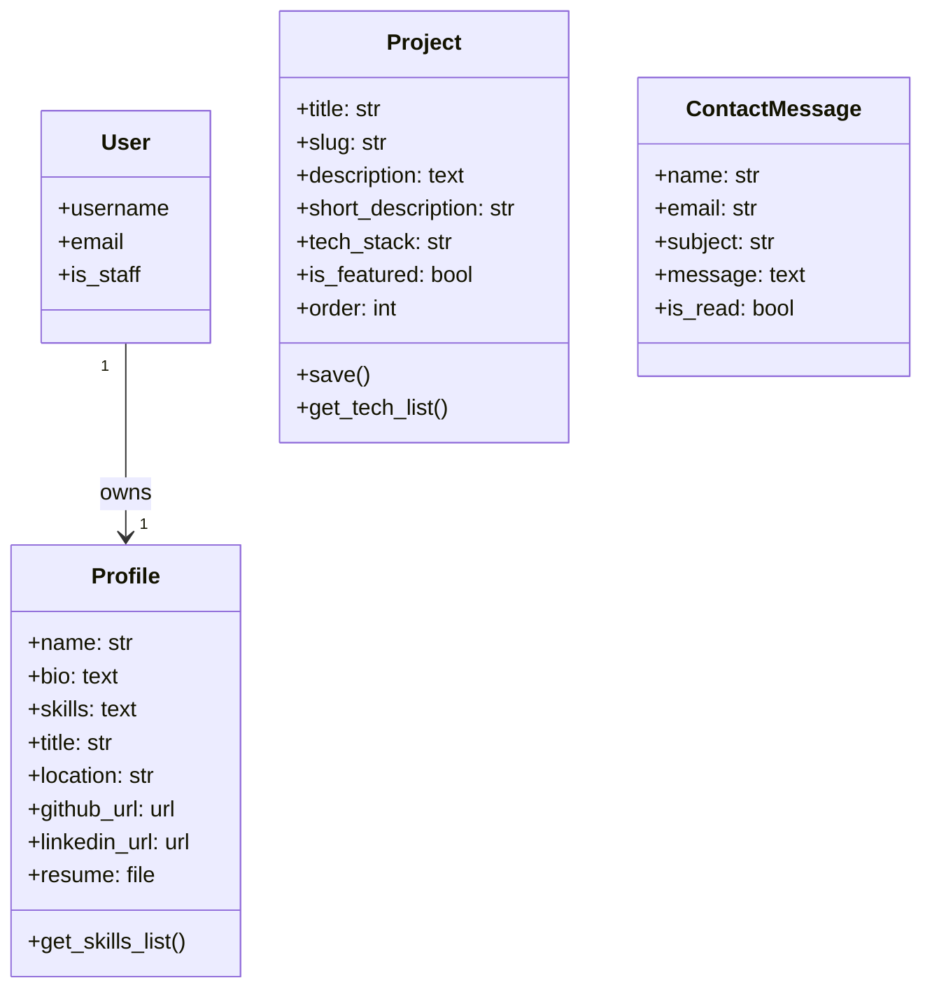
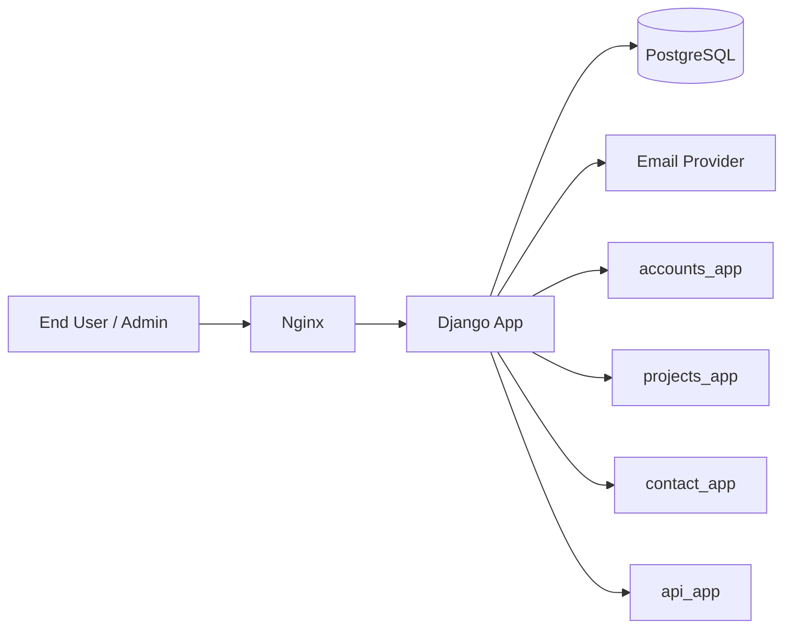
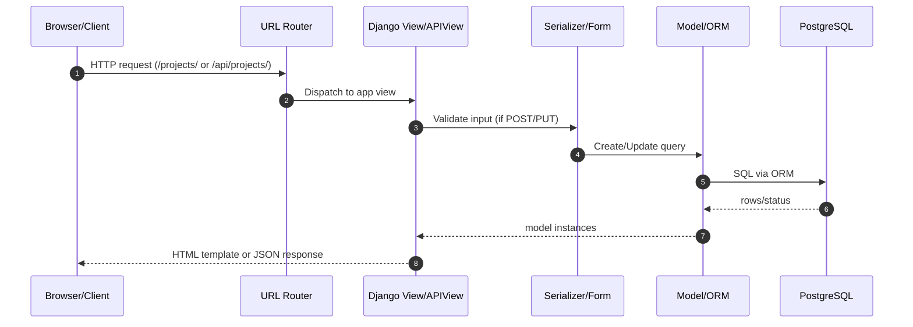

# Portfolio Project Documentation

## 1. Project Overview
This repository is a Django-based portfolio platform with:
- Public portfolio pages (home, about, projects, contact)
- Authentication and profile management
- Admin-managed project CRUD
- REST API endpoints (DRF + Token auth)
- PostgreSQL-backed persistence
- Dockerized deployment with Nginx reverse proxy

## 2. Technology Stack
- Python 3.11
- Django 4.2
- Django REST Framework
- PostgreSQL
- Nginx
- Docker / Docker Compose
- WhiteNoise, CORS headers, dj-database-url, python-decouple

## 3. System Modules
- accounts_app: User profile, signup/login, dashboard
- projects_app: Portfolio projects, slug generation, CRUD
- contact_app: Contact messages and email workflow
- api_app: REST APIs for projects/contact/profile/auth
- portfolio_site: Settings, root routing, WSGI, template engine config

## 4. Data Model Summary
- Profile (1:1 with Django User)
- Project (portfolio artifact with slug, links, tech stack)
- ContactMessage (inbound contact requests)

## 5. UML Class Diagram

## 6. High-Level Architecture Diagram

## 7. Low-Level Request Flow Diagram

## 8. Routing Summary
- Web routes mounted in `portfolio_site/urls.py`
  - `/` -> projects_app
  - `/accounts/` -> accounts_app
  - `/contact/` -> contact_app
  - `/api/` -> api_app

## 9. Security and Auth
- Session auth for web views
- Token auth for API consumers
- Admin-restricted create/update/delete for project APIs
- CSRF middleware enabled
- Configurable CORS policy

## 10. Deployment Notes
- `docker-compose.yml` wires Django, PostgreSQL, Nginx
- `wait_for_db` management command helps startup ordering
- Static files served with WhiteNoise

## 11. Improvement Opportunities
- Add pagination and filtering for API project list
- Add structured logging + monitoring
- Introduce API versioning
- Add service-layer abstraction for email sending
- Add OpenAPI schema generation and docs hosting
